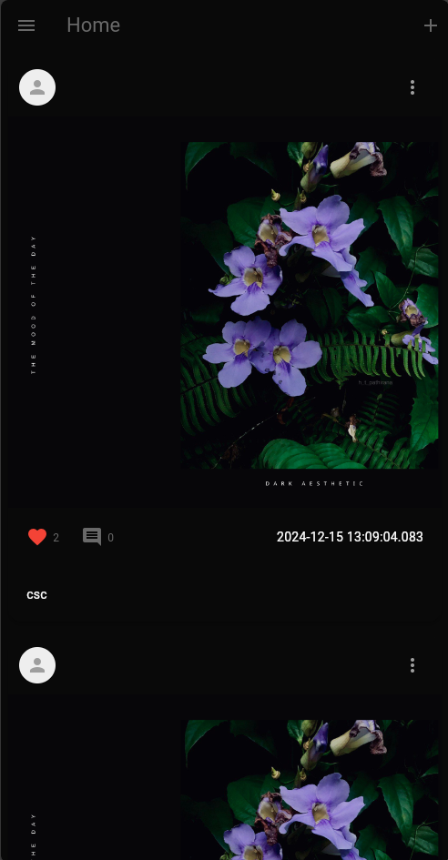
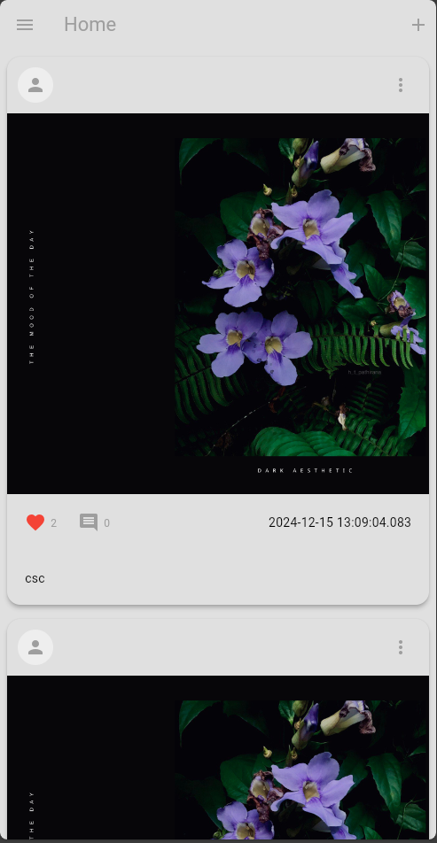
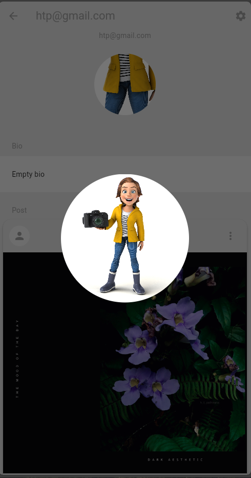
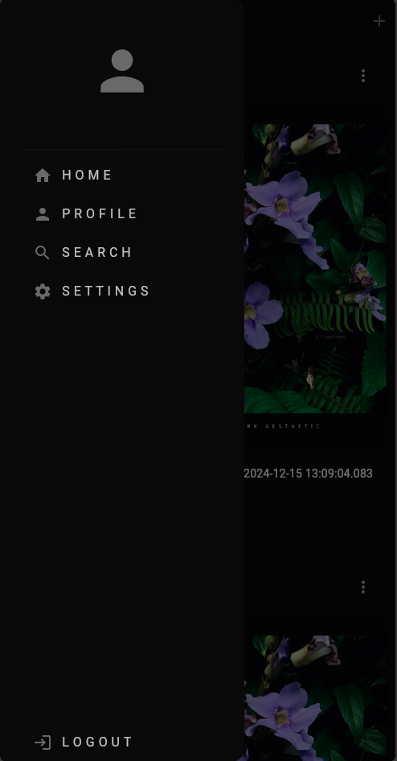

# SocialMediaF

A Flutter project that implements a modern social media application using Flutter and Firebase.

## Overview
This application is designed to provide users with an interactive and user-friendly social media experience. It allows users to create profiles, view other users' profiles, share content, and explore feeds with ease. The app's design and features are inspired by modern social platforms but cater to unique functionalities without a direct messaging feature.

## Features

- **User Profiles** - Users can create and manage their profiles, including adding profile pictures, bio information, and posts.
- **Feed Exploration** - Explore posts shared by other users, view likes, and engage with the content.
- **Post Sharing** - Users can share images and captions to the public feed, enhancing interaction and engagement.
- **Follow System** - Follow other users to keep up with their latest posts and updates.
- **Profile Customization** - Edit profile details, update profile pictures, and personalize account settings.
- **Responsive UI** - Optimized design for both mobile and tablet devices, ensuring a seamless user experience.

## Screenshots

Below are some screenshots of the application to give you a glimpse of its interface and functionality:

*The Home Screen displays the latest posts from followed users.*

*The app supports a light mode interface for better visibility.*

*The Profile Screen allows users to view and edit their profiles.*

*Users can explore detailed views of posts and profiles.*

## Technologies Used

- **Flutter**: For developing the cross-platform mobile application.
- **Firebase**: Backend services for authentication, database, and storage.

## Contribution

Contributions are welcome! Feel free to fork the repository, create a new branch, and submit a pull request.

## License

This project is licensed under the MIT License. See the LICENSE file for details.

---

